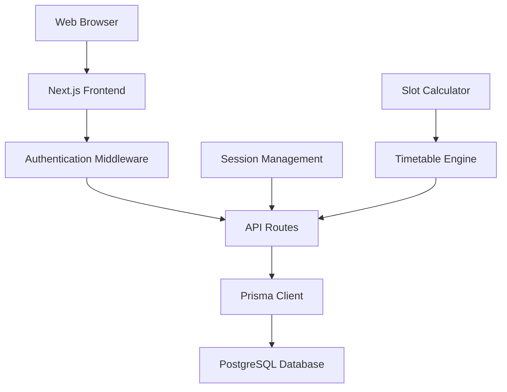
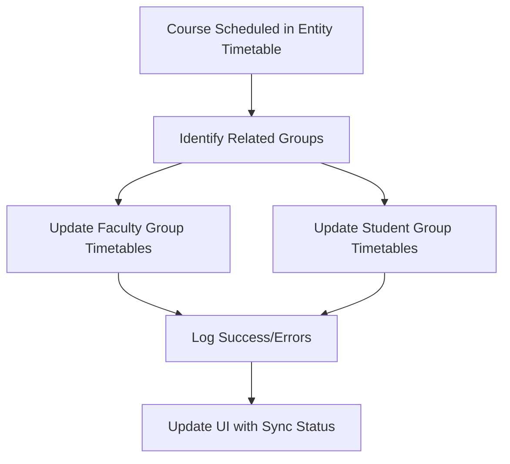

# Design Document

## Overview

The College Schedule Maker is a web-based application built with a modern stack that provides secure administrative access to manage timetables across a college system. The application leverages an existing Prisma database schema with PostgreSQL and implements a slot-based scheduling system with configurable session timing constraints.

### Key Design Principles
- **Security First**: Authentication-protected admin interface with extensible role system
- **CRUD-Focused**: Comprehensive entity management (create, read, update) for all system entities
- **Group-Based Management**: Efficient group operations with timetable inheritance and exceptions
- **Session-Scoped Data**: All data operates within configurable session boundaries with copy capabilities
- **Timetable Flexibility**: Manual timetable creation with slot fragmentation support
- **Database Integration**: Seamless integration with existing Prisma schema

### Phase 1 Implementation Scope
This design focuses on foundational CRUD operations and timetable management:
- Entity creation and management (sessions, students, faculty, halls, courses, groups)
- Group timetable creation and member inheritance
- Timetable copying between groups and sessions
- Manual slot editing with fragmentation support
- **Future Phase**: Automated scheduling algorithms and conflict resolution

## Architecture

### System Architecture


### Technology Stack
- **Frontend**: Next.js with React for server-side rendering and optimal performance
- **Backend**: Next.js API routes for serverless backend functionality
- **Database**: PostgreSQL with Prisma ORM (existing schema)
- **Authentication**: Session-based with secure cookies
- **Styling**: Tailwind CSS for responsive design
- **State Management**: React Context for global state (session, user)

### Application Flow
1. User accesses application → Login page
2. Admin authentication → Session creation → Admin dashboard
3. Session selection → Entity type navigation → Timetable management
4. Slot-based editing → Database persistence → Real-time updates

## Components and Interfaces

### Authentication System

#### Login Component
- Simple form with username/password fields
- Client-side validation and error handling
- Secure credential transmission
- Redirect logic post-authentication

#### Authentication Middleware
```typescript
interface AuthMiddleware {
  validateCredentials(username: string, password: string): Promise<UserSession>
  createSession(user: UserSession): Promise<string>
  validateSession(sessionToken: string): Promise<UserSession | null>
  requireAuth(roles: UserRole[]): MiddlewareFunction
}

interface UserSession {
  id: string
  username: string
  role: UserRole
  sessionId?: number
}

enum UserRole {
  ADMIN = 'admin',
  STUDENT = 'student', 
  PROFESSOR = 'professor'
}
```

### Session Management

#### Session Configuration
Enhanced Session model with timing constraints:
```typescript
interface SessionConfig {
  id: number
  name: string
  details?: string
  startTime: string    // "08:10"
  endTime: string      // "15:30"
  createdAt: Date
  updatedAt: Date
}

interface TimeSlot {
  startTime: string    // "08:10"
  duration: number     // minutes (e.g., 20, 30, 50, 60)
}
```

#### Session Service
```typescript
interface SessionService {
  getCurrentSession(): Promise<SessionConfig>
  updateSessionTiming(sessionId: number, timing: SessionTiming): Promise<void>
  generateTimeSlots(session: SessionConfig): TimeSlot[]
  validateSessionBoundaries(session: SessionConfig): boolean
  findConsecutiveFreeSlots(timetable: EntityTimetable, requiredDuration: number, sessionCount: number): AvailableSlot[]
}

interface SessionTiming {
  startTime: string
  endTime: string
}
```

### Timetable Management System

#### Slot-Based Data Structure
```typescript
interface TimetableSlot {
  status: number        // 0 = free, 1+ = occupied
  startTime: string     // "08:10"
  duration: number      // minutes
  courseCode?: string   // when occupied
  courseType?: string   // "LAB", "LECTURE", etc.
  hallId?: number      // assigned hall
  facultyId?: number   // assigned faculty
}

interface DaySchedule {
  [day: string]: (TimetableSlot | [number])[]  // Array of slots, free slots as [0]
}

interface CourseRequirements {
  courseCode: string
  classDuration: number      // minutes per session (e.g., 50)
  sessionsPerLecture: number // number of consecutive sessions needed (e.g., 2)
  totalSessions: number      // total sessions per week
}

interface EntityTimetable {
  entityId: number
  entityType: EntityType
  schedule: DaySchedule
  isComplete: boolean    // true for students, can be false for others
}

enum EntityType {
  STUDENT = 'student',
  FACULTY = 'faculty', 
  HALL = 'hall',
  COURSE = 'course',
  STUDENT_GROUP = 'studentGroup',
  FACULTY_GROUP = 'facultyGroup',
  HALL_GROUP = 'hallGroup'
}
```

#### Timetable Engine
```typescript
interface TimetableEngine {
  // Basic timetable operations
  loadTimetable(entityId: number, entityType: EntityType): Promise<EntityTimetable>
  saveTimetable(timetable: EntityTimetable): Promise<void>
  validateTimetable(timetable: EntityTimetable): ValidationResult
  
  // Group operations
  createGroupTimetable(groupId: number, groupType: EntityType): Promise<EntityTimetable>
  copyTimetableToGroupMembers(groupId: number, groupType: EntityType, allowExceptions: boolean): Promise<void>
  copyTimetableBetweenGroups(sourceGroupId: number, targetGroupId: number, groupType: EntityType): Promise<void>
  
  // Course scheduling synchronization
  updateRelatedGroupTimetables(courseSlot: TimetableSlot, day: string, action: 'add' | 'remove' | 'update'): Promise<void>
  syncCourseScheduleToGroups(courseId: number, facultyGroupIds: number[], studentGroupIds: number[]): Promise<void>
  
  // Session operations
  copySessionData(sourceSessionId: number, targetSessionId: number): Promise<void>
  
  // Slot fragmentation support
  fragmentSlot(slot: TimetableSlot, fragments: SlotFragment[]): TimetableSlot[]
  mergeSlots(slots: TimetableSlot[]): TimetableSlot
}

interface SlotFragment {
  duration: number
  status: number
  courseCode?: string
  courseType?: string
  hallId?: number
  facultyId?: number
}

interface ConsecutiveSlot {
  day: string
  startSlotIndex: number
  slots: TimetableSlot[]
  totalDuration: number
}

interface ValidationResult {
  isValid: boolean
  errors: string[]
  warnings: string[]
}

interface ConflictResult {
  day: string
  slotIndex: number
  conflictType: string
  description: string
}
```

### User Interface Components

#### Admin Dashboard
- Session selector dropdown with "Copy from Session" option
- Entity type navigation (Students, Faculty, Halls, Courses, Groups)
- Quick stats and overview cards
- Session management panel

#### Entity Management Views
- **Create Forms**: Standardized forms for all entity types
- **Entity Lists**: Searchable/filterable lists with pagination
- **Bulk Operations**: Multi-select for group operations
- **Import/Export**: CSV support for bulk entity creation

#### Group Management Interface
- **Group Creation**: Forms for student groups, faculty groups, hall groups
- **Member Management**: Add/remove members from groups
- **Group Timetable Access**: "View/Edit Group Timetable" button for each group
- **Timetable Operations**: 
  - "Create Group Timetable" button
  - "Apply to All Members" button
  - "Copy from Another Group" dropdown
  - Exception handling for individual members

#### Enhanced Timetable Editor
- **Manual Slot Editor**: Click-to-edit individual slots
- **Automatic Course Synchronization**: Real-time updates to related group timetables when scheduling courses
- **Slot Type Indicators**: Visual distinction between course slots (auto-synced) and manual slots
- **Group Timetable View**: Dedicated interface for viewing and editing group timetables
- **Slot Fragmentation**: Split larger slots into smaller fragments
- **Visual Grid**: Day/time grid with color-coded status
- **Bulk Operations**: Select multiple slots for batch editing
- **Copy/Paste**: Timetable copying between entities
- **Sync Status Indicators**: Show synchronization status for group updates

#### Session Management
- **Session Creator**: Form with timing configuration
- **Data Migration**: "Copy All Data from Session" functionality
- **Session Switcher**: Dropdown to change active session context

## Data Models

### Enhanced Session Model
```sql
-- Addition to existing Session table
ALTER TABLE "Session" ADD COLUMN "startTime" TEXT DEFAULT '08:10';
ALTER TABLE "Session" ADD COLUMN "endTime" TEXT DEFAULT '15:30';
```

### Enhanced Course Model
```sql
-- Addition to existing Course table for scheduling requirements
ALTER TABLE "Course" ADD COLUMN "classDuration" INTEGER DEFAULT 50;        -- minutes per session
ALTER TABLE "Course" ADD COLUMN "sessionsPerLecture" INTEGER DEFAULT 1;    -- consecutive sessions needed
ALTER TABLE "Course" ADD COLUMN "totalSessions" INTEGER DEFAULT 3;         -- total sessions per week
```

### Enhanced Timetable JSON Structure
Standardized slot-based format for all entities with flexible slot durations and group synchronization support:
```json
{
  "Monday": [
    [0],                                                    // Free slot
    [1, "08:10", 50, "CS101", "LECTURE", 101, 5, "auto"], // Auto-synced course slot
    [0],                                                    // Free slot  
    [1, "09:40", 30, "MATH202", "LAB", 205, 12, "auto"],  // Auto-synced lab session
    [1, "11:00", 20, "", "MEETING", 0, 0, "manual"]       // Manual slot (group-specific)
  ],
  "Tuesday": [
    [0], 
    [0], 
    [1, "10:10", 50, "CHEM301", "LECTURE", 301, 8, "auto"], 
    [0], 
    [1, "14:00", 20, "PHYS201", "TUTORIAL", 105, 3, "auto"]
  ],
  "Wednesday": [
    [0], 
    [1, "08:40", 50, "CS101", "LECTURE", 101, 5, "auto"],     // First session of consecutive pair
    [1, "09:30", 50, "CS101", "LECTURE", 101, 5, "auto"],     // Second consecutive session
    [1, "13:00", 60, "", "BREAK", 0, 0, "manual"],            // Manual break slot
    [0]
  ],
  "Thursday": [[0], [0], [0], [0], [0]],
  "Friday": [
    [1, "08:10", 100, "CS101", "LAB", 102, 5, "auto"],        // 100-minute lab session
    [0], 
    [0], 
    [0]
  ]
}
```

**Slot Format Enhancement:**
- **Index 7**: Slot source type ("auto" for course-synced slots, "manual" for group-specific slots)
- **Auto Slots**: Automatically synchronized from course scheduling
- **Manual Slots**: Group-specific slots (meetings, breaks) that don't propagate to members
```

### Slot Fragmentation Logic
For flexible slot management with duration mismatches:
1. **Fragmentation**: Split larger slots (60min) into smaller fragments (50min + 10min)
2. **Partial Usage**: Mark portions of slots as occupied while keeping remainder free
3. **Manual Override**: Allow admins to manually adjust slot boundaries and durations
4. **Visual Indicators**: Show fragmented slots with different visual styling

### Enhanced Group Timetable Operations

#### Core Group Operations
1. **Group Timetable Creation**: Create base timetable for entire group
2. **Member Inheritance**: Copy group timetable to all group members
3. **Exception Handling**: Allow individual members to have different timetables
4. **Group Copying**: Copy entire timetable from one group to another
5. **Bulk Updates**: Apply changes to all group members simultaneously

#### Automatic Course Synchronization
6. **Real-time Course Sync**: When courses are scheduled in any entity timetable, automatically update related group timetables
7. **Bidirectional Updates**: Course slot changes (add/remove/update) sync across all related group timetables
8. **Selective Group Updates**: Only update faculty groups and student groups (not hall groups) for course scheduling
9. **Conflict Resolution**: Handle scheduling conflicts during automatic synchronization with error logging

#### Group Timetable Management
10. **Independent Group Viewing**: Each group has its own viewable and editable timetable interface
11. **Slot Type Distinction**: Visual indicators to distinguish auto-synced course slots from manual group slots
12. **Manual Group Slots**: Allow adding group-specific slots (meetings, breaks) that don't propagate to members
13. **Sync Status Tracking**: Display synchronization status and any failed updates in the UI

#### Synchronization Flow


### Entity-Specific Validation Rules
- **Students**: All slots must be defined (0 or [1+, ...])
- **Faculty/Halls/Groups**: Only occupied slots need to be defined
- **Courses**: Represents when/where the course is scheduled

## Error Handling

### Authentication Errors
- Invalid credentials → Clear error message, remain on login
- Session expiry → Automatic redirect to login with notification
- Insufficient permissions → 403 error with explanation

### Validation Errors
- Incomplete student timetables → Highlight missing slots
- Time slot conflicts → Visual indicators and detailed descriptions
- Invalid session timing → Prevent save with specific error messages

### Database Errors
- Connection failures → Graceful degradation with retry options
- Constraint violations → User-friendly error messages
- Transaction failures → Rollback with status notification

### Error Response Format
```typescript
interface ErrorResponse {
  success: false
  error: {
    code: string
    message: string
    details?: any
    timestamp: Date
  }
}
```

## Testing Strategy

### Unit Testing
- **Authentication Service**: Credential validation, session management
- **Timetable Engine**: Slot calculations, conflict detection, validation
- **Session Service**: Timing calculations, slot generation
- **Database Operations**: CRUD operations, transaction handling

### Integration Testing
- **API Endpoints**: Request/response validation, error handling
- **Database Integration**: Prisma operations, schema compliance
- **Authentication Flow**: Login → session → protected routes

### End-to-End Testing
- **Admin Workflow**: Login → navigate → edit timetable → save
- **Session Management**: Switch sessions → verify data isolation
- **Timetable Operations**: Create → edit → validate → save complete timetables

### Test Data Strategy
- **Seed Data**: Sample sessions, students, faculty, halls, courses
- **Edge Cases**: Boundary times, maximum slots, empty timetables
- **Conflict Scenarios**: Overlapping assignments, resource conflicts

### Testing Tools
- **Unit**: Jest with React Testing Library
- **Integration**: Supertest for API testing
- **E2E**: Playwright for browser automation
- **Database**: Test database with Prisma migrations

### Performance Testing
- **Load Testing**: Multiple concurrent timetable edits
- **Database Performance**: Large dataset queries, JSON operations
- **Memory Usage**: Timetable data structures, session management

## Security Considerations

### Authentication Security
- Secure session token generation and storage
- HTTP-only cookies to prevent XSS
- CSRF protection for state-changing operations
- Session timeout and cleanup

### Data Protection
- Input validation and sanitization
- SQL injection prevention (Prisma ORM)
- XSS prevention in timetable display
- Secure password handling (future enhancement)

### Access Control
- Role-based route protection
- Entity-level permissions (future)
- Session-scoped data access
- Admin-only functionality enforcement

## Performance Optimization

### Database Optimization
- Efficient JSON queries for timetable data
- Proper indexing on frequently queried fields
- Connection pooling for concurrent access
- Query optimization for large datasets

### Frontend Optimization
- Server-side rendering for initial load
- Component lazy loading
- Efficient state management
- Optimistic updates for better UX

### Caching Strategy
- Session data caching
- Timetable data caching with invalidation
- Static asset caching
- API response caching where appropriate